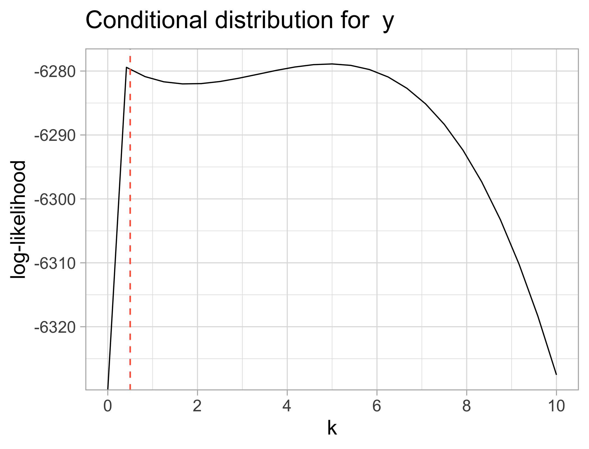

# Checking posteriors by simulation

On this section, we have the results for the posterior calculations
using the expressions found previously in this document. The 
posterior density values are calculated using simulated values, in the
same maths structure described in the "Maths" section.

In all plots, the dashed red lines represent the 'true' values
for each parameter. Ideally, these values should maximize the posteriors.
If that happens we can be more sure that our calculations are 
correct. 

The fixed parameters are $\alpha = 0.5$, $\beta = 1$, $\mu_{\mu} = 0.5$ and
$\tau_{\mu} = 0.5$

## 'High' k: 2.5 
```{r setup, include=FALSE}
knitr::opts_chunk$set(echo = FALSE, out.height = "20%", message = FALSE)
```

- This first plot is just a summary of the distribution of the simulated data, using 9 groups 
```{r}
knitr::include_graphics("img/boxplot.png")
```

- The posterior for $\tau$ seem to have maximum at a value very close to
the 'true' $\tau$ (used to simulated the data)

```{r}
knitr::include_graphics("img/post_tau.png")
```


- For both $\mu$ and $\mu_j$, that doesn't happen as we wanted, and
the maxima are not so close to the original values  

```{r}

```


```{r}
library(kableExtra)
library(tidyverse)
library(formattable)

tab <- read.table("mus.txt")

tab %>% 
  select(2:4) %>%
  mutate_all(round, 3) %>% 
  setNames(c("Index", "Posterior average", "True mu")) %>% 
  knitr::kable(escape = FALSE, format = 'html') %>%
  kable_styling(bootstrap_options = c("condensed", "hover"), 
                full_width = FALSE)
  
```


```{r}

```

## 'Small' k: 0.5 


```{r}

```


```{r}

```

```{r}

```


```{r}
library(kableExtra)
library(tidyverse)
library(formattable)

tab <- read.table("mus_ms.txt")

tab %>% 
  select(2:4) %>%
  mutate_all(round, 3) %>% 
  setNames(c("Index", "Posterior average", "True mu")) %>% 
  knitr::kable(escape = FALSE, format = 'html') %>%
  kable_styling(bootstrap_options = c("condensed", "hover"), 
                full_width = FALSE)
  
```


```{r}

```


## $y | k, \tau_{\mu}, \mu_{\mu}, \alpha, \beta$: Likelihood profiles for k, $\mu_{\mu}$ and $\beta$

```{r}

```


```{r}

```


```{r}

```

## Code 

Find the latest version at `https://github.com/brunaw/mixed_bart/blob/master/code/simulation_MB/MB_math_check.R` 


