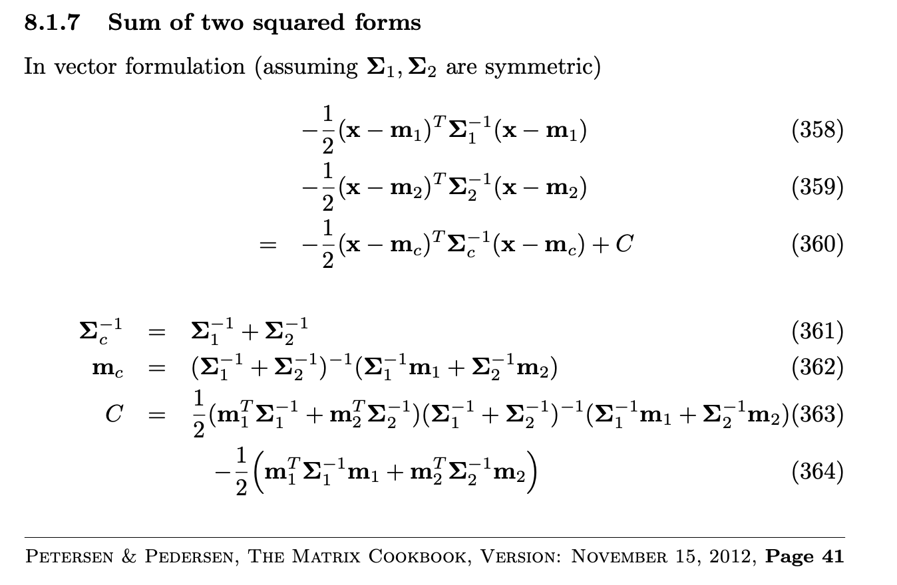

```{r setup, include=FALSE}
knitr::opts_chunk$set(echo = TRUE)
```

Let's say we assume the observations in a BART node distributed as: 

$$y_{ij}|\mu_j,\sigma^2 \sim N(\mu_j, \sigma^2)$$
where, for the $j$th group in the node, 
we have $i = 1,\dots, n_{j}$, $j = 1, \dots, m$, and 
$\sum_{j=1}^{m} n_{j} = n_{\text{node}}$. 


$$\mu_j \sim N(\mu, \sigma_b^2)$$

$$\mu \sim N(0, \sigma_\mu^2)$$
$$\sigma^2 \sim IG(a, b)$$
$$\sigma_b^2 \sim IG(c, d)$$

Task: find $y_{ij}| \sigma_{\mu}, a, b, c, d$


# New idea (March)

$$\mu_j \sim N(\mu, k \sigma^2)$$

Then you end up with:

$$y|\mu, \sigma^2, k \sim MVN(\mu, \sigma^2 A)$$
I think $A$ will be structured with 1 on the diagonal and $1/(1 + k)$ on the off-diagonal. I think it might be slightly more complicated because the are only correlated if they are in the same group. Need to check (Andrew)

$$\mu \sim N(0, \sigma_\mu^2)$$
$$\sigma^2 \sim IG(a, b)$$
$$k \sim ???$$

It should now be possible to calculate $$y | \sigma_\mu, a, b, k$$. I think!


```{r, eval = FALSE, include=FALSE}
# Function to simulate freidman data
sim_friedman = function(n, p = 0, n_groups = 3, re_sd = 0.5,
                        res_sd = 1, pars = c(10, 20, 10, 5)) {
  # Simulate some data using a multivariate version of Friedman
  # y = 10sin(pix1x2) + 20(x3-0.5)^2 + 10x4 + 5x5 + epsilon
  X = matrix(rep(runif(n * (5 + p), 0, 1),
                      each = n_groups), 
                  nrow = n*n_groups, ncol = 5 + p)
  err = rep(rnorm(n, mean = 0, sd = res_sd), each = n_groups)
  mean = pars[1] * sin(pi*X[,1]*X[,2]) + pars[2] * (X[,3]-0.5)^2 + pars[3] * X[,4] + pars[4] * X[,5]
  y = mean + err + rep(rnorm(n_groups, mean = 0, sd = re_sd), times = n)
  df = data.frame(y,
                  X, 
                  rep = rep(1:3, times = n))
  return(df)
}
df = sim_friedman(100)


```


Suppose there are $n$ observations in a terminal node and suppose that the (partial) residuals in this terminal node are denoted $R_1, \ldots, R_n$. The prior distribution for these residuals is:
$$ R_{1,j}, \ldots, R_{n, j} | \mu_j, \tau \sim N(\mu_j, \tau^{-1})$$

$$ R_{1}, \ldots, R_{n} | \mu_j, \tau \sim N(\mu_{rep_{i}}, \tau^{-1})$$


Furthermore the prior on $\mu$ is:
$$\mu_j \sim N(\mu, \frac{\tau^{-1}}{k})$$

k is assumed constant for now. 

$$\mu \sim N(0, \tau_{\mu}^{-1})$$

where j is the replica. 


Using $\pi$ to denote a probability distribution, we want to find:
\begin{align*}
\pi(R_1, \ldots, R_n| \tau) &= \int \pi(R_1, \ldots, R_n| \mu, \tau) \pi(\mu) \partial \mu \\

& \propto \int \prod_{i=1}^n \Big(\frac{\tau}{k}\Big)^{1/2} e^{-\frac{\tau}{2k} (R_i - \mu)^2} \tau_{\mu}^{1/2} e^{-\frac{\tau_\mu}{2} \mu^2 } \partial \mu \\

&= \int \Big(\frac{\tau}{k}\Big)^{n/2} e^{-\frac{\tau}{2k} \sum (R_i - \mu)^2} \tau_{\mu}^{1/2} e^{-\frac{\tau_\mu}{2} \mu^2 } \partial \mu \\

&= \int \Big(\frac{\tau}{k}\Big)^{n/2} \tau_{\mu}^{1/2} e^{-\frac{1}{2} \left[ \frac{\tau}{k} \left\{ \sum R_i^2 + n \mu^2 - 2 \mu n \bar{R} \right\} + \tau_\mu \mu^2 \right]} \partial \mu \\
&= \Big(\frac{\tau}{k}\Big)^{n/2} \tau_{\mu}^{1/2} e^{-\frac{1}{2} \left[ \frac{\tau}{k} \sum R_i^2 \right]} \int e^{-\frac{1}{2} Q} \partial \mu 
\end{align*}
where 
\begin{align*}
Q &= \frac{\tau}{k} n \mu^2 - \frac{2\tau n \mu \bar{R}}{k} + \tau_\mu \mu^2 \\
&= (\tau_\mu + n \frac{\tau}{k} ) \mu^2 - \frac{2\tau n \mu\bar{R}}{k} \\
&= (\tau_\mu + n \frac{\tau}{k} ) \left[ \mu^2 - \frac{2 \tau n \mu \bar{R} k^{-1}}{ \tau_\mu + n \frac{\tau}{k}  } \right]\\
&= (\tau_\mu + n \frac{\tau}{k} ) \left[ \left( \mu - \frac{2 \tau n \bar{R} k^{-1}}{ \tau_\mu + n \frac{\tau}{k}  } \right)^2 - \left( \frac{ \tau n \bar{R} k^{-1} }{ \tau_\mu + n \frac{\tau}{k} } \right)^2 \right]\\
&= (\tau_\mu + n \frac{\tau}{k} ) \left( \mu - \frac{2 \tau n \bar{R} k^{-1}}{ \tau_\mu + n \frac{\tau}{k}  } \right)^2 - \frac{(n \tau \bar{R} k^{-1})^2}{ \tau_\mu + n \frac{\tau}{k} }\\
\end{align*}

so therefore:
\begin{align*}
 \int e^{-\frac{1}{2} Q} \partial \mu &= \int \exp \left[  - \frac{\tau_\mu + n \frac{\tau}{k}}{2} \left( \mu - \frac{2 \tau n \bar{R} k^{-1}}{ \tau_\mu + n \frac{\tau}{k} } \right)^2 + \frac{(n \tau \bar{R} k^{-1})^2}{2( \tau_\mu + n \frac{\tau}{k})} \right] \partial \mu \\
\propto &  \exp \left[ \frac{1}{2} \frac{ (\frac{\tau}{k} n \bar{R})^2 }{ \tau_\mu + n \frac{\tau}{k} } \right] (\tau_\mu + n \frac{\tau}{k})^{-1/2}
\end{align*}

And finally:
\begin{align*}
\pi(R_1, \ldots, R_n | \tau) \propto & (\tau_\mu + n \frac{\tau}{k})^{-1/2} \left( \frac{\tau}{k} \right)^{n/2} \tau_\mu^{1/2} \exp \left[ \frac{1}{2} \frac{ (\tau n \bar{R} k^{-1})^2 }{ \tau_\mu + n \frac{\tau}{k}  } \right] \exp \left[ -\frac{\tau}{2k} \sum R_i^2 \right] \\
&= \left( \frac{\tau}{k} \right)^{n/2} \left( \frac{\tau_\mu}{\tau_\mu + n \frac{\tau}{k}} \right)^{1/2} \exp \left[ -\frac{\tau}{2} \left\{ \frac{\sum R_i^2}{k} - \frac{ \tau (n\bar{R} k^{-1})^2 }{ \tau_\mu + n \frac{\tau}{k} } \right\} \right]
\end{align*}


\subsection*{Including multiple terminal nodes}

When we put back in terminal nodes we write $R_{ji}$ where $j$ is the terminal node and $i$ is still the observation, so in terminal node $j$ we have partial residuals $R_{j1}, \ldots, R_{jn_j}$. When we have $j=1,\ldots,b$ terminal nodes the full conditional distribution is then:

\begin{align*}
\prod_{j=1}^b \pi(R_{j1}, \ldots, R_{jn_j} | \tau) &\propto \prod_{j=1}^b \left\{ \left(\frac{\tau}{k}\right)^{n_j/2} \left( \frac{\tau_\mu}{\tau_\mu + n_j \frac{\tau}{k}} \right)^{1/2} \exp \left[ -\frac{\tau}{2k} \left\{ \sum_{i=1}^{n_j} R_{ji}^2 - \frac{ \tau (n_j \bar{R}_j k^{-1})^2 }{ \tau_\mu + n_j \frac{\tau}{k} } \right\} \right] \right\}
\end{align*}


\subsection*{Updating $\mu$}

The full conditional for $\mu_{j}$ (the terminal node parameters for node $j$) is similar to the above but without the integration:

\begin{align*}
\pi(\mu_{j}|\ldots)  &\propto \prod_{i=1}^{n_j}  \left( \frac{\tau}{k} \right)^{1/2} e^{-\frac{\tau}{2k} (R_{ji} - \mu_{j})^2} \tau_{\mu}^{1/2} e^{-\frac{\tau_\mu}{2} \mu_{j}^2 }\\
&\propto e^{-\frac{\tau}{2k} \sum_{i=1}^{n_j} (R_{ji} - \mu_{j})^2} e^{-\frac{\tau_\mu}{2} \mu_{j}^2 } \\ 
&\propto e^{-\frac{\tau}{2k} \left[ n_j \mu_{j}^2 - 2 \mu_j  \sum_{i=1}^{n_j} R_{ji} \right] - \frac{\tau_\mu}{2} \mu_j^2}\\
&\propto e^{-\frac{Q}{2}}
\end{align*}

Now:
\begin{align*}
Q &= \frac{n_j \tau \mu_j^2}{k} - \frac{2\mu_j \tau S_j}{k} + \tau_\mu \mu_j^2\\
&= (\frac{n_j \tau}{k} + \tau_\mu) \mu_j^2 - \frac{2 \tau \mu_j S_j}{k} \\
&= (\frac{n_j \tau}{k} + \tau_\mu) \left[ \mu_j^2 - \frac{2 \tau \mu_j S_j}{n_j \tau + \tau_\mu k} \right] \\
&\propto (n_j \frac{\tau}{k} + \tau_\mu) \left[ \mu_j - \frac{\tau \mu_j S_j}{n_j \tau + \tau_\mu k} \right]^2
\end{align*}

so therefore:

\begin{align}
\mu_j| \ldots \sim N \left( \frac{\tau S_j}{n_j \tau + k \tau_\mu} , \left(\frac{n_j \tau}{k} + \tau_\mu\right)^{-1} \right)
\end{align}


where $S_j = \sum_{i=1}^{n_j} R_{ji}$

------------------------------------------------------------------------
# New New Idea

$$R_{ij} \sim N(\mu_j, \tau^{-1})$$
$$\mu_j \sim N(\mu, k \tau^{-1})$$
$$\mu \sim N(0, \tau_{\mu}^{-1})$$
$$R|M, \tau \sim N(A M, \tau^{-1}I)$$
where $M = [\mu_1, \mu_2, \mu_3]$ (assuming 3 replicates) and $A$ is a 3-column matrix that allocates observation $i$ to its correct replicate.
Then you have:
$$M \sim N(\mu 1_3, k \tau^{-1} I)$$
where 1 here is a column vector of 3 ones. 
Now the task is to work out:
$$\pi(R | \tau, \tau_\mu) = \int \pi(R|M, A, \tau) \pi(M | \tau) \pi(\mu | \tau_\mu) dM d\mu$$
It should be possible to work this out by substituting in all the probability distributions and following the usual 'complete the square'.
I think that you can work out $R|\tau, \tau_\mu$ quickly as:
$$R | \tau, \tau_\mu \sim N(\mu 1_3^T A, A^T k \tau^{-1} A + \tau^{-1} I)$$

*************

Let's assume a simple case where n = 10, 3 replicas, 
and $n_1= 2$,  $n_2= 3$ and   $n_1= 5$. AM is 
constructed as:


\begin{align*}
AM &= \left[\begin{array}{ccc}
  1 & 0 & 0 \\
  1 & 0 & 0 \\
  0 & 1 & 0 \\ 
  0 & 1 & 0 \\ 
  0 & 1 & 0 \\ 
  0 & 0 & 1 \\ 
  0 & 0 & 1 \\ 
  0 & 0 & 1 \\
  0 & 0 & 1 \\ 
  0 & 0 & 1 \\ 
\end{array}\right]
\begin{bmatrix}
  \mu_{1}  \\
  \mu_{2}  \\
  \mu_{3}  \\
\end{bmatrix} 
= \begin{bmatrix}
  \mu_{1}  \\
  \mu_{1}  \\
  \mu_{2}  \\
  \mu_{2}  \\
  \mu_{2}  \\
  \mu_{3}  \\
  \mu_{3}  \\
  \mu_{3}  \\
  \mu_{3}  \\
  \mu_{3}  \\
\end{bmatrix}
\end{align*}


And 

\begin{align*}
R = \begin{bmatrix}
  r_{11}  \\
  r_{12}  \\
  r_{21}  \\
  r_{22}  \\
  r_{23}  \\
  r_{31}  \\
  r_{32}  \\
  r_{33}  \\
  r_{34}  \\
  r_{35}  \\
\end{bmatrix}
\end{align*}

Now, I think that, even with R being a 1 dimensional vector
in practice, we can use matrix notation to
facilitate the integration of M. We can attempt to do the
posterior calculations: 

Define $\sum_{i = 1}^{j} n_i = n$. 

\begin{align*}
\pi(R = r_{1,1}, \dots, r_{1, n_1}, 
 \dots, r_{j, 1}, \dots, r_{j, n_j}| \tau, \tau_\mu) &= \int \pi(R|M, A, \tau) \pi(M | \tau) \pi(\mu | \tau_\mu) dM d\mu \\


\pi(R | \tau, \tau_\mu) &=

\int \left[\frac{e^{\left( \frac{- (R - MA)^{T}(\tau I)  (R - MA)}{2}   \right)}}{(2 \pi)^{n/2} |(\tau^{-1} I)|^{n  /2}} \right]

\left[ \frac{e^{\left( \frac{- (M - \mu I)^{T}(k \tau I)  (M - \mu I)}{2}   \right)}}{(2 \pi)^{j/2} |(k \tau^{-1} I)|^{j/2}} \right]

\left[ \frac{\tau_{\mu}^{1/2}}{(2 \pi)^{1/2}} e^\frac{-\mu^{2} \tau_{\mu}}{2} 
\right] dM d\mu \\

&= \left[\frac{1}{(2 \pi)^{n/2} |(\tau^{-1} I)|^{n/2}}
\frac{1}{(2 \pi)^{j/2} |(k \tau^{-1} I)|^{j/2}}
\frac{\tau_{\mu}^{1/2}}{(2 \pi)^{1/2}} \right]  \times \\

& \int e^{-\frac{1}{2}\left( (R - MA)^{T}(\tau I)  (R - MA) + 
(M - \mu I)^{T}(k \tau I)  (M - \mu I) + \mu^{2} \tau_{\mu} \right)} dM d\mu \\

& \text{We need to find a quadratic form here, to integrate M out:} \\
& \propto \int e^{-\frac{1}{2}\left(
(M  - RA^{-1})^{T}(-\tau IA)(M  - RA^{-1}) + 
(M - \mu I)^{T}(k \tau I)  (M - \mu I) + \mu^{2} \tau_{\mu} \right)} dM d\mu \\


\end{align*}

with which we can use:


```{r, echo = FALSE}

```


where:

$$\Sigma^{-1}_{1} = -\tau I A$$
$$\Sigma^{-1}_{2} = k\tau I$$

$$ m_1 = RA^{-1}$$

$$ m_2 = \mu I$$

then
$$\Sigma^{-1}_{c} = (-\tau I A + k\tau I)$$
$$m_c =  (-\tau I A + k\tau I)^{-1}( (-\tau I A)(RA^{-1}) + (k\tau I)\mu I)$$

$$C = ((RA^{-1})(-\tau I A) + \mu I(k\tau I)) (-\tau I A + k\tau I)^{-1} \\
((-\tau I A)(RA^{-1}) + (k\tau I)\mu I) + 
((RA^{-1})^{T}(-\tau I A)(RA^{-1}) + \mu I^{T}(k\tau I)\mu I)$$


and then we go back to the calculation with:


\begin{align*}

\pi(R | \tau, \tau_\mu) & \propto \int e^{\frac{-1}{2}\left(
(M  - RA^{-1})^{T}(-\tau IA)(M  - RA^{-1}) + 
(M - \mu)^{T}(k \tau I)  (M - \mu) + \mu^{2} \tau_{\mu} \right)} dM d\mu \\

& = 
\int
e^{\frac{-1}{2}\left( 
(M  - m_{c})^{T}(-\tau I A + k\tau I)(M  - m_c) -L C + \mu^{2} \tau_{\mu} \right)} dM d\mu \\ 


& = (2 \pi |(-\tau I A + k\tau I)|)^{j/2}
\int
\frac{e^{\frac{-1}{2}\left(
(M  - m_{c})^{T}(-\tau I A + k\tau I)(M  - m_c) \right)}}{(2 \pi |(-\tau I A + k\tau I)|)^{j/2}} dM e^{\frac{C - \mu^{2} \tau_{\mu}}{2}}d\mu \\ 

& \propto  \int e^{\frac{C - \mu^{2} \tau_{\mu}}{2}}d\mu \\ 


\end{align*}

Let's arrange C in a cleaner way as:

$$ C = (-\tau(R + \mu k)) (-\tau(A + k))^{-1}(-\tau(R + \mu k)) + \\
((RA^{-1})^{T}(-\tau R) + k\tau \mu^{2} I)$$


Is this making sense?