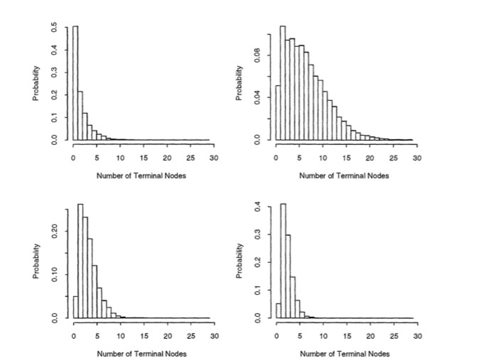
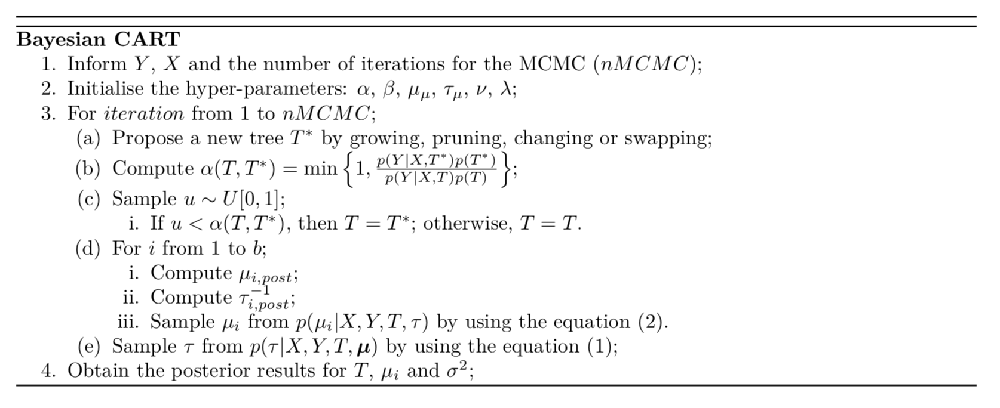
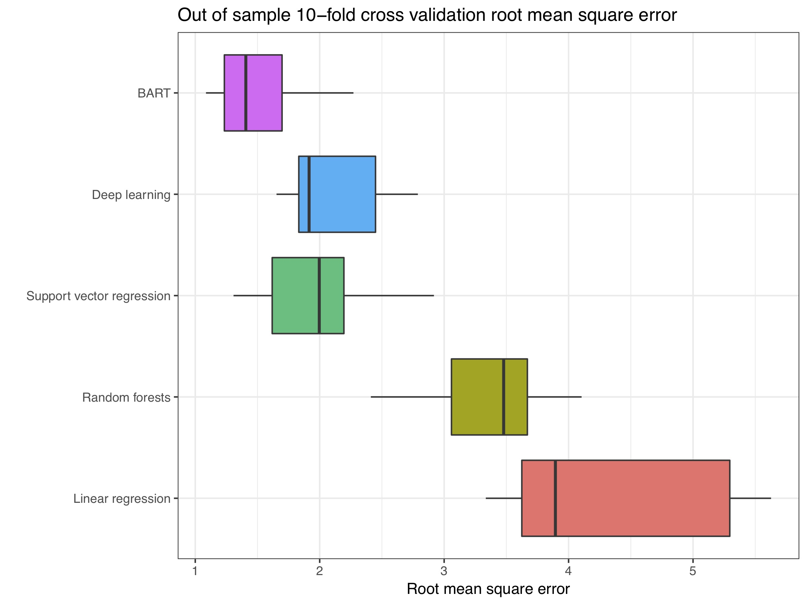
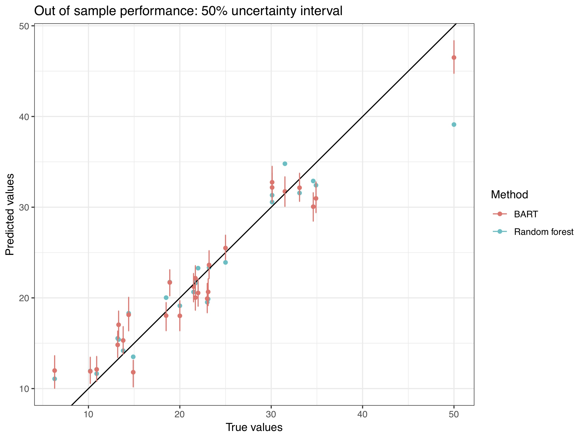

```{r setup, include=FALSE}
options(htmltools.dir.version = FALSE)
knitr::opts_chunk$set(warning = FALSE, message = FALSE, 
                      comment = NA, dpi = 300,
                      fig.align = "center", 
                      out.width = "70%", 
                      cache = FALSE,
                      echo = FALSE)
library(tidyverse)
library(RefManageR)
bib_file = "seminars/bart/bibliography.bib"
bib <- ReadBib(bib_file, check = FALSE)
```


# Introduction 

Bayesian decision tree methods have experienced rapid development in recent years, being firstly proposed by Chipman, George, and McwCulloch (1998). 


$$\Huge y = \sum_{j=1}^M g(X, T_j, \Theta_j, \mu_j) + \epsilon$$

Chipman, Hugh A., Edward I. George, and Robert E. McCulloch. BART: Bayesian additive regression trees. _The Annals of Applied Statistics 4_, no. 1 (2010): 266-298.

---

# BCART

- The Bayesian CART model is a tree-based algorithm that allows us 
to introduce prior beliefs into the structure of the tree.

- Fundamentally differs from usual trees in the sense that it
posits a full probability model for the data, combining a prior 
distribution $P(\mathcal{T})$ for the tree structure, with a likelihood
$P(\mathcal{D} | \mathcal{T})$, $D =\{(X_i, Y_i): 1 \leq i \leq N \}$. 

- Two main components:  a tree $\mathcal{T}$ with $b$
terminal nodes, and a parameter set
$\Theta = (\theta_1,\dots,\theta_b)$ that associates each parameter
$\theta_i$ with the $i$th terminal node.

---
# BCART

The association of each individual observation with the terminal node
is made by denotting $y_{ij}$ the $j$th observation of the $i$th node,
being $i = 1,\dots,b$ and $j = 1,2,\dots,  n_i$. Define

$$Y \equiv  (Y_1,...,Y_b)'$$

and 
$$Y_i \equiv (y_{i1}, \dots, y_{in_i})'$$


and $X$ and $X_i$ are analogous. We typically assume that conditionally
on $(\Theta, \mathcal{T})$, the values of $y$ in a node are i.i.d., and 
across terminal nodes they are independent. The distribution for the
data is defined as 

$$P(Y | X, \Theta, \mathcal{T}) = \prod_{i = 1}^{b}f(Y_i | \Theta_i) = \prod_{i = 1}^{b} \prod_{j = 1}^{n_i}f(y_{ij} | \theta_i)$$


---
# BCART
  
  - Regression cases: $f(y_{ij} | \theta_i)$ follows a Normal distribution. 

The mean shift model is set as

$$y_{i1}, \dots, y_{in_i} | \theta_i \sim \mathcal{N}(\mu_i, \sigma^2),
\thinspace i = 1,\dots, b,$$
  
and the mean-variance shift model is defined as 

$$y_{i1}, \dots, y_{in_i} | \theta_i \sim \mathcal{N}(\mu_i, \sigma^2_i),
\thinspace i = 1,\dots, b$$


---

# BCART
  
  Since the model is identified by $(\Theta, \mathcal{T})$, we specify 
a prior probability distribution $P(\Theta, \mathcal{T})$. We 
conveniently use the relationship

$$P(\Theta, \mathcal{T}) = P(\Theta | \mathcal{T}) P(\mathcal{T}), $$
  
  and specify the two distributions separately.

- This strategy offers the advantage of choosing a prior to $\mathcal{T}$ 
  that does not depend on the family of $\theta$. 


---
  
  # The form of $P(\mathcal{T})$
  
  -  Not exactly defined with a closed-form:
  determined by a tree-generating stochastic process, and each generation
  of this process (with MCMC) is considered a draw from this prior.  
  
The whole process is describe as:
  1. Setting a tree $\mathcal{T}$ with a root node. 
  2. Split the terminal node $\eta$ with probability 
  $P_{SPLIT}(\eta, \mathcal{T})$. 
  3. Split a rule $\rho$ with probability 
  $P_{RULE}(\rho | \eta, \mathcal{T})$. Let 
  $\mathcal{T}$ denote the new tree and repeat the process. 

$P_{SPLIT}(\eta, \mathcal{T})$ is commonly
taken as $\alpha(1 - d_{\eta})^{b}$, where $d_{\eta}$ denotes 
the depth of the $\eta$ node. 
- the resulting prior $P(\mathcal{T})$ will put higher
probabilities on 'bushy' trees.
---

  
```{r psplit, fig.cap="Different specifications for the probability of splitting a node (Chipman et al., 1998)", out.height="90%", out.width="90%"}

```


---
  
  For the entire tree, we have that

$$P(\mathcal{T}) = \prod_{\eta \in \mathcal{H}\text{terminals}} (1 - P_{SPLIT}(\eta ))\prod_{\eta \in \mathcal{H}\text{internals}} 
P_{SPLIT}(\eta ) 
\prod_{\eta \in \mathcal{H}\text{internals}} 
P_{RULE}(\rho | \eta )$$
  
  where $\mathcal{H}\text{terminals}$ represent the terminal nodes, while
the $\mathcal{H}\text{internals}$ represent the internal nodes. So, for a 
new split, for example, this probability is: 
  
$$P(\mathcal{T*}) = (1 -  P_{SPLIT}(\eta_L )) (1 - P_{SPLIT}(\eta_R )) P_{SPLIT}(\eta) P_{RULE}(\rho | \eta )$$
  
where $\eta_L$ and $\eta_R$ represent the left and right node 
respectively, and they both have $d_{\eta_R}  = d_{\eta_L} = d_{\eta}  + 1$.

As for $P_{RULE}(\rho | \eta, \mathcal{T})$, it is usually
taken as a discrete uniform distribution over the range of 
values 'left' to be split on in each node and each variable. So
we can define 

$$P_{RULE}(\rho | \eta, \mathcal{T}) = 
  \frac{1}{p_{adj}(\eta)} \frac{1}{n_{j.adj}(\eta)}$$
  
  where $p_{adj}(\eta)$ represents how many predictors are still
available to split in the node, and $n_{j.adj}(\eta)$ how many
values in a given predictor are still available. 

---
## Parameter priors
  
  - Conjugate priors, assuming conditional independence between the nodes. 

Using the mean-shift model,
$(\Theta, \mathcal{T})$ has a simple prior with a standard
conjugate form 

$$\mu_1, \dots, \mu_b | \sigma^2, \mathcal{T} 
\sim \mathcal{N}(0, \sigma^2_{\mu})$$
  
  considering that $y$ was scaled beforehand  and that
$\sigma_\mu = \frac{y_{max}}{2}$, which will give us
$\mu_\mu + 2 \sigma_\mu =  y_{max}$. The prior for the
dispersion of $y$ is set as 

$$ \tau = 1/\sigma^2_y \sim Gamma(\nu/2, \lambda\nu/2),$$
  
  with the parameters $\lambda$ and $\nu$ being found in order to give
high probabilities of the BCART model improving an ordinary least 
squares model. 

---
## Parameter posteriors
  
\begin{align}
P(\mu_i | X, Y, \mathcal{T}, \tau) & \propto
P(Y| X, \mathbf{\mu}, \tau, \mathcal{T}) 
P(\mathbf{\mu} | \sigma^2_\mu, \mathcal{T}) \\
& \propto \Big [ \prod_{j = 1}^{n_i} \mathcal{N}(y_{ij} | \mu_i, \tau)
                \Big] \mathcal{N}(\mu_i | \sigma^2_\mu, \mathcal{T}) \\
& \propto   exp \Big\{-\frac{\tau}{2}
  \sum_{j = 1}^{n_i} (y_{ij} - \mu_i)^{2}
  \Big \} exp \Big\{-\frac{\sigma^{-2}_{\mu} \mu_i^{2} }{2}
    \Big \} \\
& \propto exp \{ - Q/2 \}
\end{align}

where 

\begin{align}
Q 
& \propto
(\sigma^{-2}_{\mu} + n_i \tau) \Big [ \mu_i -
                                       \frac{\tau \sum_{j = 1}^{n_i} y_{ij}}{(\sigma^{-2}_{\mu} + n_i \tau) }
                                     \Big]^{2}
\end{align}


giving us that the posterior distribution for $\mu_i$ is 
$\mathcal{N}\Big(\frac{\tau \sum_{j = 1}^{n_i} y_{ij}}{(\sigma^{-2}_{\mu} + n_i \tau)}, (\sigma^{-2}_{\mu} + n_i \tau)^{-1}\Big)$.

---
## Parameter posteriors

The posterior for $\tau = 1/\sigma^2_y$ is found as 


\begin{align}
P(\tau | X, Y, \mathcal{T}, \mathbf{\mu}) & \propto
P(Y| X, \mathbf{\mu}, \tau, \mathcal{T}) P(\tau) \\
& \propto
\tau^{\frac{\nu + n}{2} - 1} exp \Big\{
-\frac{\tau}{2} \Big(
\sum_{i = 1}^{b} \sum_{j = 1}^{n_i}(y_{ij} - \mu_i)^2 + 
\nu \lambda \Big) \Big\}
\end{align}

giving us a final posterior as 

$$\tau = 1/\sigma^2_y \sim G \Big(\frac{\nu + n}{2}, \frac{\tau}{2} \Big(\sum_{i = 1}^{b} \sum_{j = 1}^{n_i}(y_{ij} - \mu_i)^2 + \nu \lambda \Big) \Big)$$

---
## Parameter posteriors

The conditional posterior distribution of $\mathcal{T}$ is given by

\begin{align}
P(\mathcal{T} | X, Y) & \propto
P(\mathcal{T}) \int \int   P(Y| X, \mathbf{\mu}, \tau, \mathcal{T}) 
P(\mathbf{\mu} | \tau \mathcal{T}) P(\tau) d\tau d\mathbf{\mu} \\
& \propto P(\mathcal{T}) P(Y| X, \mathcal{T}) 
\end{align}

> MCMC to sample from the posterior. 

---

# Possible actions

The transition kernel of the MCMC generates new trees
(denoted by $\mathcal{T*}$) by randomly choosing among 4 steps:

- **Grow**: Split a terminal node into two new ones. The node is
picked randomly accordingly to the $P_{RULE}$.  
- **Prune**: Prune a parent of two terminal nodes, by collapsing it.  
- Change: Randomly reassign the splitting rule of a terminal node. 
- Swap: Randomly pick a parent-child pair that are both internal nodes. 
Swap their splitting rules, unless the other child has an identical rule. 

*Grow and prune are the most usual steps. 

---

# Sampling algorithm

```{r, out.height="110%", out.width="110%"}

``` 

where the probability of transition actually can be factorized in 

$$r =\underbrace{\frac{P(\mathcal{T*} \rightarrow \mathcal{T})}{P(\mathcal{T} \rightarrow \mathcal{T*})}}_{\text{Transition ratio}}\underbrace{\frac{P(Y | \mathcal{T*}, \tau )}{(Y | \mathcal{T}, \tau )}}_{\text{Likelihood ratio}} \underbrace{\frac{P(\mathcal{T*})}{P(\mathcal{T}) }}_{\text{Tree structure ratio}}$$ 

---

## For a grow proposal

$$P(\mathcal{T*} \rightarrow \mathcal{T}) = p(GROW)  \frac{1}{b} \frac{1}{p_{adj(\eta)}} \frac{1}{n_{j.adj(\eta)}}$$

where b is the number of terminal nodes, $p_{adj(\eta)}$ denotes the
number of predictors left available to split  and $n_{j.adj(\eta)}$
the number of values left to split in the picked variable. 

$$P(\mathcal{T} \rightarrow \mathcal{T*}) = p(PRUNE)  P(\text{selecting } \eta \text{ to prune from}),$$


$$\frac{P(\mathcal{T*})}{P(\mathcal{T}) } = 
\frac{(1 -  P_{SPLIT}(\eta_L )) (1 - P_{SPLIT}(\eta_R )) P_{SPLIT}(\eta) P_{RULE}(\rho | \eta )}{(1 -  P_{SPLIT})},$$

and 
$$\frac{P(Y | \mathcal{T*}, \tau )}{(Y | \mathcal{T}, \tau )} = \sqrt{\frac{\tau^{-1}(\tau^{-1} + \sigma^2_{\mu})}{(\tau^{-1} +  n_{\mathcal{l}_L}\sigma^2_{\mu})(\tau^{-1} + n_{\mathcal{l}_R}\sigma^2_{\mu})}} \\ exp \Big\{\frac{\tau \sigma^2_{\mu} }{2}  \Big(\frac{(\sum_{i = 1}^{n_{\mathcal{l}_L}} y_{\mathcal{l}L, i})^2} {\tau^{-1} + n_{\mathcal{l}_L}\sigma^2_{\mu}} + \frac{(\sum_{i = 1}^{n_{\mathcal{l}_R}} y_{\mathcal{l}R, i})^2} {\tau^{-1} + n_{\mathcal{l}_R}\sigma^2_{\mu}} - \frac{(\sum_{i = 1}^{n_{\mathcal{l}}} y_{\mathcal{l}, i})^2} {\tau^{-1} + n_{\mathcal{l}}\sigma^2_{\mu}}\Big\}$$ 

where $n_{\mathcal{l}}$ is the total of observations in the grown node, 
$n_{\mathcal{l}_L}$ are the total in the resulting left node, and
$n_{\mathcal{l}_R}$ is analogous.
---
    
# Gibbs sampling
    

    
---

# BART

BART can be considered a sum-of-trees ensemble.
Specifically, the model can be expressed as

$$\mathbf{Y} = f(\mathbf{X}) + \mathbf{\epsilon} \approx \mathcal{T_1^{M}}(\mathbf{X}) + \dots + \mathcal{T_m^{M}}(\mathbf{X}) + \mathbf{\epsilon}, \mathbf{\epsilon} \sim \mathcal{N_n}(\mathbf{0}, \tau^{-1}\mathbf{I}_n)$$

Here, we have $m$ distinct regression trees, each composed of a tree 
structure, denoted by $\mathcal{T}$, and the parameters at the terminal 
nodes denoted by $M$. 

$$P(\mathcal{T_1^{M}},\dots,\mathcal{T_m^{M}}, \tau ) = \Big[\prod_{t}\prod_{\mathcal{l}} P(\mu_{t, l} | \mathcal{T_t}) P(\mathcal{T_t}) \Big] P(\tau)$$


---

# BART

A Metropolis-within-Gibbs sampler (Gelman and Gelman 1984; Hastings 1970)
is employed to generate draws from the posterior distribution of $P(\mathcal{T_1^{M}},\dots,\mathcal{T_m^{M}}, \tau | \mathbf{y})$.

The key of this sampler is to employ a form of “Bayesian backfitting” 
(Hastie and Tibshirani 2000) where the $j$th tree is fit iteratively, 
holding all other $m − 1$ trees constant by exposing only the residual 
response that remains unfitted:

$$\mathbf{R_{-j}} := \mathbf{y} - \sum_{t \neq j} \mathcal{T}_t^{M}(\mathbf{X})$$

---

# BART works

A commonly used method for simulating complex regression-type data is:

$$y = \beta_1 \sin(\pi x_1 x_2) + \beta_2 (x_3 - 0.5)^2 + \beta_3 x_4 + \beta_5 x_5 + \epsilon; \; \epsilon \sim N(0, 1)$$

where $x_j \sim N(0, 1)$ for $j=1, \ldots, 5.$

From the (Friedman, 1991) paper, called Multivariate Adaptive 
Regression Splines. 

Task: create good predictions of $y$ and identify which variables are 
important. 
---

# BART works


```{r, echo = FALSE, out.height="100%", out.width="80%"}

```


---

class: big

# Key BART advantages

- Very good prediction properties.

- Deals with interactions and non-linear relationships.

- Based on a probability distribution so 'easily' extendable.

- A Bayesian model: have probabilistic uncertainty intervals for any required quantities. 

---

# BART prediction intervals

```{r, echo = FALSE, out.height="100%", out.width="80%"}

```


---

# BART problems & extensions

- The fitting algorithm is the main bottleneck. 
  - Not scalable

- Choosing split variables and values uniformly is very far from 
  optimal. 

- Better ways to explore trees?

- Lots of modeling types still not covered. 
  - Since BART is built on a standard set of probability distributions 
  it's quite easily extendable to other types of models *if you can still
  perform the collapsing over the terminal node parameters*


---
# References 


```{r, results='asis'}
library(RefManageR)
bib_file = "seminars/bart/bibliography.bib"
bib <- ReadBib(bib_file, check = FALSE)
print(bib[key = c("Rmanual", "bartmachine",
                  "Chipman2010", "Chipman1998")], 
      .opts = list(check.entries = TRUE, 
                   style = "html", 
                   bib.style = "authoryear"))
```


---

class: center, middle, inverse

# Thanks!


 

<b>

[@brunaw](https://github.com/brunaw)
