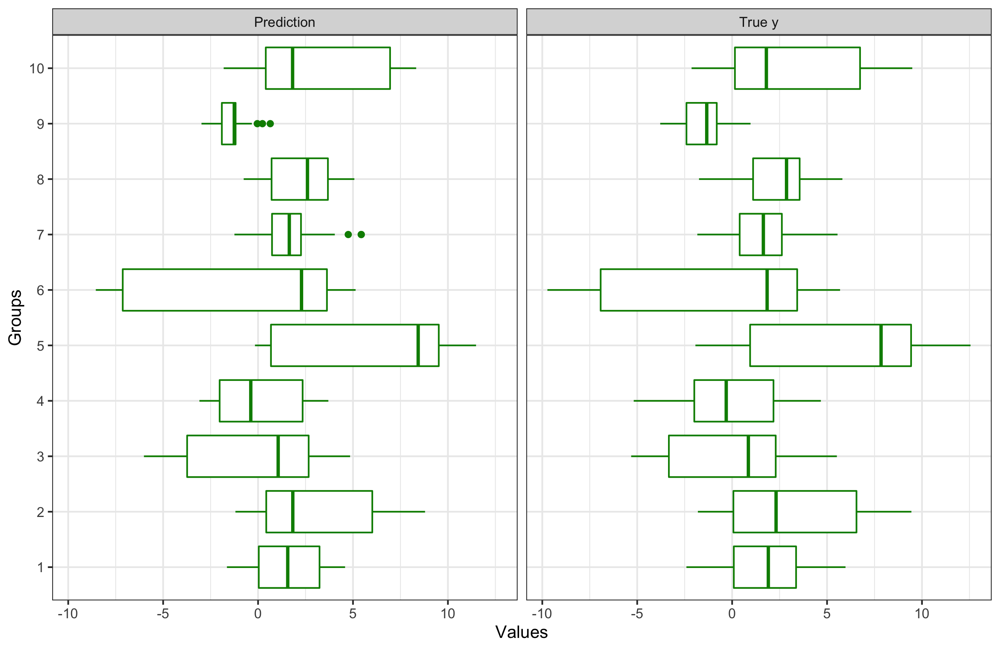
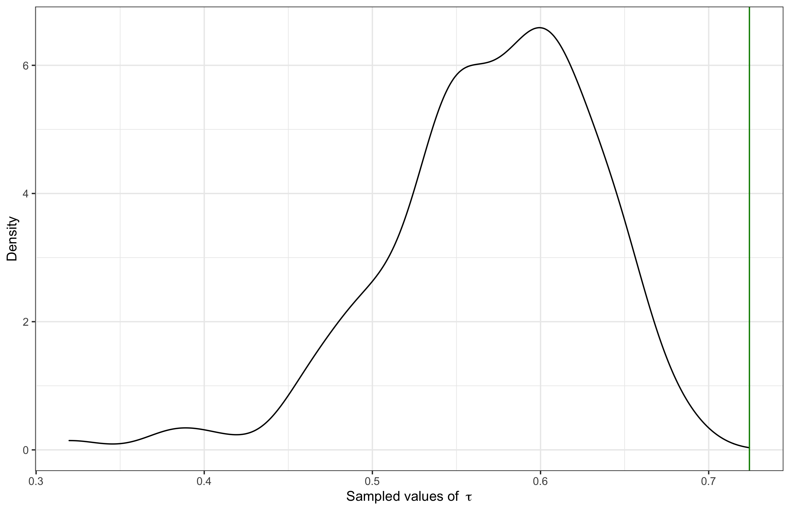

```{r setup, include=FALSE}
options(htmltools.dir.version = FALSE)
knitr::opts_chunk$set(collapse = TRUE,
                      message = FALSE, 
                      warning = FALSE, 
                      cache = FALSE, 
                      eval = TRUE, 
                      echo = FALSE, 
                      fig.pos = 'center')

library(ymlthis)
library(tidyverse)
library(xaringanExtra)
xaringanExtra::use_panelset()
xaringanExtra::use_share_again()
# xaringanExtra::style_share_again(
#   share_buttons = c("twitter", "linkedin", "pocket")
# )

library(RefManageR)
bibs <- ReadBib("references.bib", check = FALSE)
```

```{r broadcast, echo=FALSE}
xaringanExtra::use_broadcast()
```


class: title-slide, center, middle


# `r rmarkdown::metadata$title`

## `r rmarkdown::metadata$author`

### `r rmarkdown::metadata$subtitle`
### `r rmarkdown::metadata$date`


---

name: clouds
class: center, middle
background-image: url(images/forest.png)
background-size: cover

```{css, echo=FALSE}
.panelset {
  --panel-tab-font-family: Work Sans;
  --panel-tab-background-color-active: #fffbe0;
  --panel-tab-border-color-active: #023d4d;
}

.panelset .panel-tabs .panel-tab > a {
	color: #023d4d;
}
```


## .big-text[Hello]


## Bruna Wundervald


[GitHub: @brunaw](https://github.com/brunaw)  
[Twitter: @bwundervald](https://twitter.com/bwundervald)  
[Page: http://brunaw.com/](http://brunaw.com/)


---


class: bottom, middle, inverse

# Roadmap

- BCART
- BART
- Hierarchical BART


---


class: bottom, left, inverse

# BCART


---


class: bottom, left

# BCART

- A tree-based algorithm that puts prior beliefs into:
  - the structure of the tree,
  - the node parameters 

- Main components: 
  - a tree $\mathcal{T}$ with $b$ terminal nodes, 
  - a parameter set $\Theta = (\theta_1,\dots,\theta_b)$ that 
  associates each parameter $\theta_i$ with the $i$th terminal node.

---

class: middle, left

# BCART

- Proposes a full probability model for the data: 
> combines a prior distribution $P(\mathcal{T})$ for the tree structure with a likelihood
$P(\mathcal{D} | \mathcal{T})$, $D =\{(X_i, Y_i): 1 \leq i \leq N \}$. 


---

class: middle, left

# BCART

...with that, we have 

$$Y_i \equiv (y_{i1}, \dots, y_{in_i})',$$

where $i$ represents the $i$th node ( $i = 1, \dots, b$, $X$ and $X_i$ are analogous).  


Conditionally
on $(\Theta, \mathcal{T})$, the values of $y$ in a node are i.i.d., and 
across terminal nodes they are independent: 

$$P(Y | X, \Theta, \mathcal{T}) = \prod_{i = 1}^{b}f(Y_i | \Theta_i) = \prod_{i = 1}^{b} \prod_{j = 1}^{n_i}f(y_{ij} | \theta_i)$$

---

class: middle, left

# BCART


 We specify  a prior probability distribution $P(\Theta, \mathcal{T})$
 using the relationship: 

$$P(\Theta, \mathcal{T}) = P(\Theta | \mathcal{T}) P(\mathcal{T}) $$

- $P(\mathcal{T})$: does not have a closed form, but can be defined as: 

$$P(\mathcal{T}) = \prod_{\eta \in \mathcal{H}\text{Ter}} (1 - P_{SPLIT}(\eta ))\prod_{\eta \in \mathcal{H}\text{Int}} 
P_{SPLIT}(\eta ) 
\prod_{\eta \in \mathcal{H}\text{Int}} 
P_{RULE}(\rho | \eta )$$

where  $\mathcal{H}\text{Ter}$= terminal nodes and
$\mathcal{H}\text{Int}$ = internal nodes. 


---

class: middle, left

# BCART

  
  - $P_{SPLIT}(\eta, \mathcal{T})$: probability of splitting the 
  terminal node $\eta$; 
    - depends on the depth of $\eta$
  
  - $P_{RULE}(\rho | \eta, \mathcal{T})$: probability of splitting 
  at a rule $\rho$ in terminal node $\eta$; 
    - depends on the number of available predictors and their range of available values in the node $\eta$
  

---


class: bottom, left, inverse

# BART

---

class: middle, left

# BART

- A sum-of-trees ensemble:

$$\mathbf{Y} = f(\mathbf{X}) + \mathbf{\epsilon} \approx \mathcal{T_1}^{P}(\mathbf{X}) + \dots + \mathcal{T_p}^{P}(\mathbf{X}) + \mathbf{\epsilon}, \mathbf{\epsilon} \sim \mathcal{N_n}(\mathbf{0}, \tau^{-1}\mathbf{I}_n)$$

Where $P$ = number of distinct trees, each composed of a tree 
structure  $\mathcal{T}$

$$P(\mathcal{T_1}^{P},\dots,\mathcal{T_p}^{P}, \tau ) = \Big[\prod_{t}\prod_{\mathcal{l}} P(\mu_{t, l} | \mathcal{T_t}) P(\mathcal{T_t}) \Big] P(\tau)$$


---

class: middle, left

# BART


A Metropolis-within-Gibbs sampler (Gelman and Gelman 1984; Hastings 1970)
generates posterior draws from
$P(\mathcal{T_1}^{P},\dots,\mathcal{T_p}^{P}, \tau | \mathbf{y})$.

- “Bayesian backfitting” (Hastie and Tibshirani 2000): the $j$th tree 
is fit iteratively, 
holding all other $P − 1$ trees constant by exposing only the residual 
response that remains unfitted:

$$\mathbf{R_{-j}} := \mathbf{y} - \sum_{t \neq j} \mathcal{T}_t^{P}(\mathbf{X})$$

---

class: middle, center
    
# Gibbs sampling
    


    


---


class: bottom, left, inverse

# Hierachical BART


---

class: middle, left

# Hierachical BART

- A version of BART where we have a 'group' information for
each obeservation

$$Y_{ij} = \sum_{p = 1}^{P} \mathbb{G}(X_{ij}, T_{p}, \Theta_{p}) + \epsilon_{ij}$$
for observation $i = i, \dots, n_j$ in group $j = 1, \dots, J$

---

class: middle, left

## Hierachical BART

$$\epsilon_{ij} \sim N(0, \tau^{-1})$$

where $\tau^{-1}$ is the residual precision

- $\Theta_{p}$: terminal node parameters + the individual group parameters for tree $p$:  


---

class: middle, left

## Hierachical BART

$$\underset{\sim}{R_j} \sim N(\mu_j, \tau^{-1}),$$


$$\mu_{jpl} \sim N(\mu, k_1\tau^{-1}/P),$$


$$\mu_{pl} \sim N(0, k_2 \tau^{-1}/P)$$

with $l = 1, \dots, n_{p}$, where $n_{p}$ is the number of nodes in tree p, and $\sum_{p = 1}^{P} n_p = N_p$. 


---

class: middle, left

# Hierachical BART


- $k_1$: $\mu_{jpl}$ precision scaling parameter

- $k_2$: $\mu_{pl}$ precision scaling parameter


---

class: middle, left

## Posteriors 

\begin{equation}
\mu | \dots \sim N(
\frac{\mathbf{1}^{T} \Psi^{-1} R }{\mathbf{1}^{T} \Psi^{-1} \mathbf{1} + (k_2/P)^{-1}},
\tau^{-1} (\mathbf{1}^{T} \Psi^{-1} \mathbf{1} + (k_2/P)^{-1})), 
\end{equation}

\begin{equation}
\mu_j | \dots \sim MVN( 
\frac{P \mu /k_1 + \bar R_j n_j}{(n_j + P/k_1)}, 
\tau^{-1} (n_j + P/k_1))
\end{equation}

where $\Psi =  k_1 MM^{T} + \mathbb{I}$, $\bar R_j$ = residual mean, 
$n_j$ = # obs per group 

---

class: middle, left

## Posteriors 

$$\tau | \dots \sim Ga(\frac{N + J N_p + N_p}{2} + \alpha, \\
\frac{\sum_{i= 1}^{N}(y_i - \hat f_i)^2}{2} + \frac{P \sum_{j, l, p}(\mu_{j, l, p} - \mu_{l, p})^2}{2 k_1} + \frac{P \sum_{l, p}\mu_{l, p}^2}{2 k_2} + \beta)$$


---

class: middle, center


```{r, out.width="75%"}

```


---

class: middle, center


```{r, out.width="75%"}

```


---

class: middle, left

# Resources


---


---
class: middle

# References

```{r, echo = FALSE, eval = TRUE, results='asis'}
print(bibs, 
      .opts = list(check.entries = FALSE, 
                   style = "html", 
                   bib.style = "authoryear"))
```


---
background-image: url(images/forest.png)
background-size: cover
class: center, middle, inverse

# .big-text[Questions?]


---


class: bottom, left, inverse

*An Introduction to BART and Hierarchical BART*,

Bruna Wundervald 

# Thank you!


