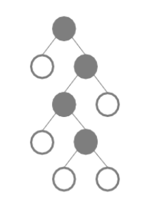

```{r setup, include=FALSE}
options(htmltools.dir.version = FALSE)
knitr::opts_chunk$set(warning = FALSE, message = FALSE, 
  comment = NA, dpi = 300, echo = FALSE,
  fig.align = "center", out.width = "60%", cache = FALSE,
  fig.path = "figs/")
library(tidyverse)
library(RefManageR)
bibs <- ReadBib("seminar-serie/bibliography.bib", check = FALSE)
library(gganimate)
ozcols <- wesanderson::wes_palette("FantasticFox1")[c(2:3)]
```

class: title-slide, center, bottom


# `r rmarkdown::metadata$title`

## `r rmarkdown::metadata$subtitle`

### `r rmarkdown::metadata$author` &#183; Ph.D. Candidate in Statistics

#### `r params$event` &#183; `r params$date`

---
name: hello
class: inverse, left, middle


# Summary 
  - Trees and Random Forests
  - Regularization in Random Forests 
  - Implementation
  - Results 
  - Bayesian Optimization 

---
background-image: url(img/paths.png)
background-size: contain

---
name: hello
class: inverse, left, middle

So actually, 

# Summary 
  - Trees and Random Forests (this part was fine)
  - <del> Regularization in Random Forests </del> The lack of 
  references about Regularization in Random Forests
  - "Regularization" or "Regularisation"?
  - We finally understood what Regularization in Random Forests means
  - New ideas about Regularization in Random Forests
  - <del> Implementation </del>  Suffering, so much suffering 
  - <del> Results  </del> Some results from the many many models I had to run
  - <del> Bayesian Optimization </del> Trying to solve a problem we ourselves
  created 


---
class: center, inverse, middle

# I) Regularization in Random Forests


---

# Problem setup 

Consider a set of train response-covariates pairs 
$(Y_i, \mathbf{x}_i) \in \mathbb{R} \times \mathbb{R}^{p}$, 
with $i = 1, \dots, N$ indexing the observations, and $p$ being 
the total number of covariates. If $Y_i$ is continuous,
statistical framework regression characterizes
the relationship between each $i$-th pair as 

\begin{equation}
y_i = f(\mathbf{x}_i) + \epsilon, \thinspace \epsilon_i 
\overset{\hphantom{\text{iid}}}{\sim} N(0, \sigma^2),
\end{equation}

where $f$ is the unknown regression function to be estimated as
$f$. 

 - Frequently a prediction task
 - Not all covariates need to be involved in $\hat f$
 - Especially for tree-based models, the occurrence of noisy or correlated variables
 is usually not detected


---

# Regularization

- Regularized regression consists of estimating a penalized function 
of the form

\begin{equation}
\underset{f \in H}{min} \Big[ \sum_{i = 1}^{N}
L(y_i, f(x_i)) + \lambda J(f) \Big ], 
\end{equation}


where $L(y, f(x))$ is the chosen loss function, $J(f)$ is a penalty
functional, and $H$ is a space of functions on which $J(f)$ is defined
`r Cite(bibs[key = "HastieTrevor"])`

> Goal: to produce models that are more parsimonious (use fewer variables)
and have similar prediction error as the full model

- Robust enough to not be influenced by the correlated variables


---
class: middle

# Trees 

Tree-based models are a composition of adaptive basis functions of the form


\begin{equation}
f(\mathbf{x}) = \mathbb{E}[y \mid \mathbf{x}] = 
\sum_{d = 1}^{\mathbb{D}} w_d \mathbb{I}(\mathbf{x} \in R_{d}) = 
\sum_{d = 1}^{\mathbb{D}} w_d \phi_d(\mathbf{x}; \mathbf{v}_d),
\end{equation}

where 
  - $R_d$ is the $d$-th estimated region in the predictors'space , 
  - $w_d$ is the prediction given to each region, 
  - and $\mathbf{v}_d$ represents the variable and correspondent splitting value `r Cite(bibs[key = "probml"])`.

---
class: middle

# Trees 

Normally fitted using a greedy procedure, which computes 
a locally optimal maximum likelihood estimator. The splits are made in order to minimize the cost function, as

\begin{equation}
(i*, t*)  =  arg  \min_{i \in \{1, \dots, P\}}
\min_{t\in \mathbb{T}_i } [cost (\{\mathbf{x}_i, \mathbf{y}: x_{ij} \leq t \}) \thinspace +  cost (\{\mathbf{x}_i, \mathbf{y}: x_{ij} > t\})]
\end{equation}

where  $i$ represents the $i$-th feature, with its correspondent
$\mathbb{T}_j$ possible split thresholds for region $D$.

---

# Trees - Graphical description

.pull-left[
```{r echo=FALSE, out.width="80%"}
knitr::include_graphics("img/trees.png")
```


]
.pull-right[

```{r echo=FALSE, out.width="90%"}
knitr::include_graphics("img/vars_space.png")
```

]


---
class: middle
# Trees  - Cost functions 


For regression, the cost used in a tree-based model is frequently defined as 

\begin{equation}
cost(D) = \sum_{i \in D} (y_i - \bar{y})^{2}, 
\label{eq:error}
\end{equation}

where $\bar{y} = (\sum_{i \in D} y_i) |D|^{-1}$
is the mean of the training observations in the specified region,
while for classification this function gets replaced by the
missclassification rate

\begin{equation}
cost(D) = \frac{1}{|D|}
\sum_{i \in D} \mathbb{I}(y_i \neq \hat y).
\end{equation}


---
class: middle
# Trees  - Importance values 


The gain of making a new split is a normalized
measure of the reduction in the cost, 

\begin{equation}
\Delta(i, t) = cost(D) - 
\Big(
\frac{|D_{LN_{(i, t)}}|}{|D|} cost (D_{LN_{(i, t)}}) +
\frac{|D_{RN_{(i, t)}}|}{|D|} cost (D_{RN_{(i, t)}})\Big), 
\label{eq:cost_tree}
\end{equation}

for variable $i$ at the splitting point $t$, and $D$ is relative 
to the previous estimated split. When we accumulate this gain over a variable, 
$\mathbf{\Delta}(i) = \sum_{t \in \mathbb{S}_i} \Delta(i, t)$,  we obtain its **importance value**.

---

# Random Forests

  - Trees are known to be high variance estimators
    - They are unstable: small changes in the data can lead 
to the estimation of a completely different tree 

- An average of many estimates has smaller variance than only one estimate 

This concept applied in the growth of many trees in 
resamples the data, randomly chosen with replacement
from the original training set, resulting in a tree ensemble

$$f(\mathbf{x}) = \sum_{n = 1}^{N_{tree}} \frac{1}{N_{tree}} f_n(\mathbf{x}),$$

where each $f_n$ corresponds to each $n$-th tree. Unlike the regular tree models, 
the Random Forests only try $m \approx \sqrt{p}$ = `mtry` variables at each split, to
decorrelate the learners  `r Cite(bibs[key = "Breiman2001"])`

---

# Random Forests - Importance values

The importance values are accumulated over all the trees of a 
Random Forest, forming

\begin{equation}
Imp_{i} = \sum_{n = 1}^{N_{tree}} \mathbf{\Delta}(i)_{n},
\end{equation}

for the feature $\mathbf{x}_{i}.$


.pull-left[

## Trees
```{r echo=FALSE, out.width="30%"}

```

] 
.pull-right[

## Random Forests
```{r echo=FALSE, out.width="100%"}
knitr::include_graphics("img/rf.png")
```
]


---
class: middle

# Regularization in Random Forests 

In `r Citet(bibs[key = "guided"])`, the authors discuss the idea of regularising 
Random Forests models by penalizing the gain of each 
variable, or 

$$Gain_{R}(\mathbf{x}_{i}, t) = \begin{cases}
\lambda_i \Delta(i, t), \thinspace  i \notin \mathbb{U} \text{ and} \\
\Delta(i, t), \thinspace  i \in \mathbb{U}, 
\end{cases}$$

where $\mathbb{U}$ is the set of indices of the covariates previously used, 
$\mathbf{X}_{i}, i \in \{1, \dots, p\}$ is the candidate covariate for splitting
and $t$ the respective splitting point.

  - To enter $\mathbb{U}$ a variable needs to improve upon the gain of 
  all the currently selected variables, even after its gain is penalized 

---
class: middle
  
## Drawbacks   
  - A very simple framework with no warranties
  - Does not considers the effects of `mtry` in the models
  - Not many examples/references/maths reasoning behind it 
  - How should we set $\lambda_{i}$?

---
class: center, inverse, middle

```{r echo=FALSE, out.width="10%"}

```


# New ideas about  $\lambda_{i}$


---

# Extensions of $\lambda_{i}$

We propose that $\lambda_i$ can be composed by

\begin{equation}
\lambda_i = (1 - \gamma) \lambda_0 + \gamma g(\mathbf{x}_i), 
\label{eq:generalization}
\end{equation}

where 

  - $\lambda_0 \in [0, 1)$ can be interpreted as the 
baseline regularization, 
  - $g(X_i)$ is a function of the respective $i$-th feature,
  - $\gamma \in [0, 1)$ is their mixture parameter, under the resctriction that $\lambda_i \in [0, 1)$
  

The $g(\mathbf{x}_i)$ 
should be set in a way that will represent relevant information about the 
covariables, based on some characteristic of interest
  - This has inspiration on the use of priors made in Bayesian methods:
    -  introduces previous information between the covariables and the response to guide the model

  
---

## Suggestions for $g(\mathbf{x}_i)$ 


- **Correlation:** the absolute values of the marginal correlations
(Pearson's, Kendall's or Spearman's) of each feature and the response
(continuous cases),  or 
$$g(\mathbf{x}_i) = |corr(\mathbf{y}, \mathbf{x}_i)|$$ 

- **Entropy/Mutual Information:** a way of giving more weight to variables that have lower uncertainties, or 

$$g(\mathbf{x}_i) = 1 - \frac{\mathbb{H}(\mathbf{x}_{i})}{max_{j=1}^{P} \mathbb{H}(\mathbf{x}_{i)}} \text{ or  } g(\mathbf{x}_i) = \frac{\text{MutInf}(\mathbf{y}, \mathbf{x}_i)}{max_{j=1}^{P}\text{MutInf}( \mathbf{y}, \mathbf{x}_j)}$$

- **Boosting:** to use the normalized importance values obtained from a previously
run Machine Learning model (Random Forests, SVM, GLMs, etc), or 

$$g(\mathbf{x}_i)  = \frac{Imp_i}{max_{j = 1}^{P} Imp_j}$$


---

## Depth parameter


- We introduce the idea of increasing a penalisation considering the current depth  of a tree as
$$Gain_{R}(\mathbf{X}_{i}, t, \mathbb{T}) = 
\begin{cases} \lambda_{i}^{d_{\mathbb{T}}} \Delta(i, t), \thinspace i \notin \mathbb{U} \text{ and} \\ \Delta(i, t), \thinspace i \in  \mathbb{U}, 
\end{cases}$$

where $d_{\mathbb{T}}$ is the current depth of the $\mathbb{T}$ tree. 

- The idea is inspired by `r Citet(bibs[key = "Chipman2010"])`, that uses 
prior distributions for whether a new variable should be considered or not for a new split
in a Bayesian Regression Tree, taking into account their current depth

---

# Implementation 

.pull-left[

## Before
  - Only available in the `rrf` package `r Cite(bibs[key = "guided"])`
  - Not very scalable: code based on the original `randomForest` 
  implementation

] 
.pull-right[

## Now
  - Added to the `ranger` package `r Cite(bibs[key = "rangerR"])`
  - Written in `c++` interfacing with `R`
  - Interfaces with `python`
  - Has the option of considering the depth of the tree in 
  the regularization
]


---

# Implementation 

`https://github.com/imbs-hl/ranger` 

```{r, out.width="90%"}

```


Note: `https://github.com/regularization-rf/ranger` 
not merged yet 

---

# Experiments - Regression 

Let us consider now a set  $\mathbf{X} = (\mathbf{x_{1}},\dots, \mathbf{x_{p}})$ of
covariates, all sampled from a Uniform[0, 1] distribution, and
with $p = 250$ and $n = 1000$. We generated a variable of interest 
$\mathbf{Y} \in \mathbb{R}$  as 
 
$$\begin{equation} \mathbf{y} = 0.8 sin(\mathbf{x}_1 \mathbf{x}_2) + 2 (\mathbf{x}_3 - 0.5)^2 + 1 \mathbf{x}_4 + 0.7 \mathbf{x}_5 + \sum_{j = 1}^{200} 0.9^{(j/3)} \mathbf{x}_{j+5} +  \sum_{j = 1}^{45} 0.9^{j} \mathbf{x}_5 + \mathbf{\epsilon},  \thinspace \mathbf{\epsilon} \sim N(0, 1), \end{equation}$$

producing
- non-linearities in $i=(1, 2, 3)$
- decreasing importances  in $i=(6,\dots,205)$
- correlation between the variables in $i=(5, 206,\dots,250)$


- Standardized $\mathbf{y}$

---
class: middle

.pull-left[

## Standard Random Forest

- 10 datasets split in train (80%) and test (20%) sets

- All resulting models used the 250 variables 

- The models keep attributing high importances to the 
correlated variables 

**Not great so far!**

]
.pull-right[

```{r echo=FALSE, out.height="80%", out.width="80%", fig.align="center"}

```


]

---

class: middle

## Regularized Random Forests

- Same 10 datasets as before

- Evaluated the effects of
  - `mtry` = (15, 45, 75, 105, 135, 165, 195, 225, 250)
  - $\lambda_0 = (0.1, 0.3, 0.5, 0.7, 0.9)$
  - $\gamma = (0.001, 0.25, 0.5, 0.75, 0.99)$
  - $g(\mathbf{x_i}) = (|corr(\mathbf{y}, \mathbf{x}_i)|, \thinspace  \text{Boosted}_{RF}, \thinspace \text{Boosted}_{SVM})$
  

---

background-image: url(img/results_corr.png)
background-size: contain

### $g(\mathbf{x_i}) = |corr(\mathbf{y}, \mathbf{x}_i)|$

---

background-image: url(img/results_guided.png)
background-size: contain

### $g(\mathbf{x_i}) = \text{Boosted}_{RF}$


---

background-image: url(img/results.png)
background-size: contain

### $g(\mathbf{x_i}) = \text{Boosted}_{SVM}$
---


# Experiments - Classification 

.pull-left[
  - 8 Gene classification  datasets from `r Citet(bibs[key = "DiazUriarte2007"])`, where P >> n, split into train (2/3) and 
  test (1/3) sets
  
  
```{r,  results='asis'}
library(formattable)
library(kableExtra)

tab <- read.table("seminar-serie/aux/dfs_info.txt") %>% 
    slice(-c(1, 8)) 

tab %>% 
  select(4, 1:3)  %>% 
  knitr::kable(escape = FALSE, format = 'html',
               caption="Classification datasets'specifications") %>%
  kable_styling(bootstrap_options = c("condensed", "hover"), 
                full_width = FALSE) %>% 
  column_spec(2, width = "4cm")  

```


]

.pull-right[

  - Used $\gamma = \lambda_0 = 0.5$, `mtry` = $(\sqrt{p}, 0.15p, 0.40p, 0.75p,  0.95p)$ and  $g(\mathbf{x_i}) = (\text{MutInf}(\mathbf{y}, \mathbf{x}_i), \thinspace  \text{Boosted}_{RF})$, compared to a
Standard Random Forest 


- **Regularized Random Forests as a variable selection procedure:**
  - Extract the variables selected by each model and run a Standard
  Random Forest with them 
  - 10 different reruns for each model


]

---

## Classification - Results

- From the optimal resulting models: 

.pull-left[
```{r, results='asis'}
res_classification <- readRDS("seminar-serie/aux/res_classification.rds")

res_classification$mean_error %>% 
  mutate(dataset = tab$dataset) %>% 
  rowwise %>% 
  mutate(d = min(unlist(
    c(`Standard RF`, `Boosted (RF)`, `Boosted (MI)`)))) %>% 
  mutate_at(vars(1, 2, 3), 
            list(~ifelse(. == d, color_bar("lightgreen")(.), .))) %>% 
  select(-d) %>% 
  select(4, 1, 2, 3) %>% 
  knitr::kable(escape = FALSE, format = 'html',
               caption="Mean error rates in the test set") %>%
  kable_styling(bootstrap_options = c("condensed", "hover"), 
                full_width = FALSE) %>% 
  column_spec(2, width = "4cm")  

```
]

.pull-right[
```{r}
res_classification$mean_vars %>% 
  mutate(dataset = tab$dataset) %>% 
  rowwise %>% 
  mutate(d = min(as.numeric(unlist(
    c(`Standard RF`, `Boosted (RF)`, `Boosted (MI)`))))) %>% 
  mutate_at(vars(1, 2, 3), 
            list(~ifelse(. == d, color_bar("lightgreen")(.), .))) %>% 
  select(-d) %>% 
  select(4, 1, 2, 3) %>% 
  knitr::kable(escape = FALSE, format = 'html',
               caption="Mean number of variables used") %>%
  kable_styling(bootstrap_options = c("condensed", "hover"), 
                full_width = FALSE) %>% 
  column_spec(2, width = "4cm")  
```


]


---
class: middle

# Conclusions 

- Variable selection in Random Forests is still a topic to be explored

- Using "prior" knowledge about the features to regularize the 
Random Forests seem to produce good results in terms
of the (number of variables) x (prediction error) trade-off

- This knowledge can be balanced combined with a baseline
regularization to achieve better results

- We cannot ignore the role of the `mtry` parameter in the Regularized
Random Forests 


---
class: center, inverse, middle

# II) Bayesian Optimization 

---
class: middle

## From the Regularized Random Forests

 - We have been left with a few parameters to set/estimate:
  - $\lambda_0$, $\gamma$, `mtry` and maybe even $g(\mathbf{x_i})$
  
- Options: Expert experience, rules of thumb or even brute force
    - Might take a lot of time
    
---


# Bayesian Hyperparameter Optimization

  - **We are interested in finding the minimum of a function $f(x)$ on some bounded $\mathcal{X} \in \mathbb{R}^{D}$, or**
  
  $$x^* = \underset{x \in \mathcal{X}}{\text{arg min}} f(x)$$


Basically, <b> we build a probability model of the objective function and use it to select the most promising parameters, </b> 

$$ P(\text{objective } | \text{ hyperparameters})$$
where the objectives are, e.g., the RMSE , misclassification rate, etc.
We need:

$$\underbrace{\text{Prior over } f(x)}_{\text{Our assumptions about the  functions being optmized}} + \underbrace{\text{Acquisition function}}_{\text{Determines the next point to evaluate}}$$

`r Cite(bibs[key = "bayesopt"])` 


---
class: middle

## Prior over $f(x)$: Gaussian Processes 

- The classical prior in Bayesian Optimization
- The GPs are defined by the property that any finite set of $N$ points
induces a Multivariate Gaussian distribution on $\mathbb{R}^{N}$
  - Mean function $m: \mathcal{X} \rightarrow \mathbb{R}$ and 
    covariance function $K: \mathcal{X} \times \mathcal{X} \rightarrow \mathbb{R}$
- Convenient and powerful as a prior: very flexible


---
class: middle

## Acquisition Function 

We can now assume $f(\mathbf{x}) \sim GP$ (prior) and 
$y_n \sim \mathcal{N}(f(\mathbf{x}_n), \nu)$, where $\nu$ is the noise
introduced into the function observations. 

- Acquisition Function: $a: \mathcal{X} \rightarrow \mathbb{R}^{+}$, 
determines what point in $\mathcal{X}$ should be the next evaluated 
  - Generally depends on the previous observation and the GP hyperparameters: $a(\mathbf{x}; {\mathbf{x}_n, y_n}, \theta)$
  
Best current value:

$$\mathbf{x}_{best} = \underset{\mathbf{x}_n}{\text{arg min}} f(\mathbf{x}_n)$$
Most popular: <b> Expected improvement</b>

  $$a_{\text{EI}}(\mathbf{x}; {\mathbf{x}_n, y_n}, \theta) = \sigma(\mathbf{x}; {\mathbf{x}_n, y_n}, \theta)[\gamma(\mathbf{x})\Phi(\gamma(\mathbf{x}) + \mathcal{N}(\gamma(\mathbf{x}); 0, 1)]$$
---

# Algorithm 


.content-box-grey[

1. Choose some **prior** over the space of possible objectives $f$

2. Combine prior and likelihood to get a **posterior** over the objective,
given some observations

3. Use the posterior to find the next value to be evaluated, according
to the chosen **acquisition function**

4. Augment the data (with the new best value)

]

> Iterate between 2 and 4 until you are satisfied


---

## Acquisition Function: in action

```{r, out.width="75%"}
knitr::include_graphics("img/utility.gif")
```

Adapted from: `https://github.com/glouppe/talk-bayesian-optimisation`


---

# BHO in Regularized Random Forests

What we want to find is 

$$ P(\text{Error}_{test} / \text{# Variables Used } | \lambda_0, \gamma, \texttt{mtry}) $$

## Some results
  - Input: the resulting $\text{RMSE}_{test} / \text{# Variables Used}$
  of the models using the combinations of 
  
    - $\gamma = (0.001, 0.12575, 0.2505, 0.37525, 0.50) \times \lambda_0 = (0.5, 0.6, 0.7, 0.8, 0.9)$ 
    $\times \texttt{mtry} = (0.05p, 0.2125p, 0.375p, 0.5375p, 0.7p)$ and  $g(\mathbf{x_i}) = \text{Boosted}_{SVM}$ for the 
Regression simulated data

- Used the best-predicted values as hyperparameters in the next 20 models 

---

.pull-left[
## Some results

```{r, out.width="90%"}

```

]

.pull-right[
## Conclusions (so far)

- Bayesian Hyperparameter Optimization is useful when we need
to set hyperparameters in a model but do not have much knowledge
about it

- It can be applied to the Regularized Random Forests for optimizing
the trade-off between the number of variables used and the prediction
error

- The final results of this section should
be a package that automatically finds good hyperparameters using
BO
]


---
class: center, middle

## Acknowledgments

This work was supported by a Science Foundation Ireland Career Development Award grant number: 17/CDA/4695

```{r, echo=FALSE, fig.align='center', out.height="40%", out.width="50%", fig.height=2}
knitr::include_graphics("img/SFI_logo.jpg")
```


---

# References

```{r, results='asis', eval = TRUE}
print(bibs[key = c("guided", "bayesopt", "probml",
                   "ranger", "DiazUriarte2007", 
                  "Breiman2001", "Friedman1991")], 
      .opts = list(check.entries = FALSE, 
                   style = "html", 
                   bib.style = "authoryear"))
```


---

class: inverse, center, middle

# Thanks!


 

<b>[@brunaw](https://github.com/brunaw)
