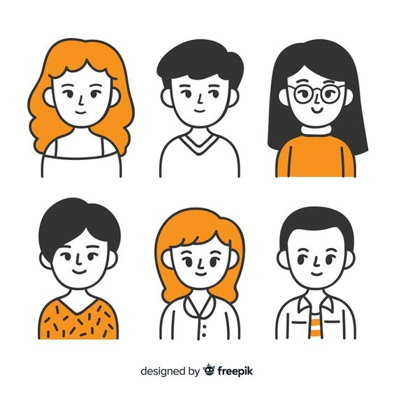

```{r setup, include=FALSE}
options(htmltools.dir.version = FALSE)
knitr::opts_chunk$set(warning = FALSE, message = FALSE, 
  comment = NA, dpi = 300, echo = FALSE,
  fig.align = "center", out.width = "60%", cache = FALSE,
  fig.path = "figs/")
library(tidyverse)
library(RefManageR)
bibs <- ReadBib("bibliography.bib", check = FALSE)
library(gganimate)
ozcols <- wesanderson::wes_palette("FantasticFox1")[c(2:3)]

#-------
library(tidyverse)
library(lme4)
```

class: title-slide, center, bottom


# `r rmarkdown::metadata$title`

## `r rmarkdown::metadata$subtitle`

### `r rmarkdown::metadata$author` &#183; Ph.D. Candidate in Statistics

#### `r params$event` &#183; `r params$date`

---
name: hello
class: inverse, left, middle


# Summary 
  - Grouped data 
  - Intro to BART 
  - HE-BART
  - Results 
  - Conclusions & comments 


---


# Grouped/hierachical data 
.pull-left[

- Observations are aggregated into groups
- Usually there is an **intra-group variance** that needs
to be accounted for  (non-independence)
- Examples include:
  - Clinical data (repeated measures per patient)
  - Longitudinal data 
  - Block design
  - ...

]

.pull-right[

```{r, out.width="90%"}

```

]

---

# Bayesian Additive Regression Trees (BART)

- A tree-based algorithm that allows us 
to introduce prior beliefs into the structure of the tree

- Models the response variable $y$ as 

$$\Large y = \sum_{p=1}^P g(X, \mathcal{T}_p, \Theta_p, \mu_p) + \epsilon$$

where $g(...)$ represents the tree look-up function and P is the number of trees
  
Chipman, Hugh A., Edward I. George, and Robert E. McCulloch. BART: Bayesian additive regression trees. _The Annals of Applied Statistics 4_, no. 1 (2010): 266-298.


---

## BART

- It's a sum of Normal distributions where
each location parameter is modeled by a 
tree-structure 

- Each tree is 'fit' on the residuals of
the previous ones 

```{r, out.width="100%"}
knitr::include_graphics("img/sum-trees.png")
```

- It can be
  - A mean-shift model: location parameters change across nodes
  - A mean-variance shift model: dispersion parameters also change
  across nodes
  

---

## BART

The full Bayesian setting attributes probability
distributions to all parameters
  
- $\Theta$: location and dispersion parameters
    - $\mu$ is often taken as $\mu \sim N(\mu_{\mu}, \tau_{\mu})$
    - $\tau$ is often taken as $\tau \sim \text{Ga}(\alpha, \beta)$
  
- Tree structures $\mathcal{T}$:
    - Probability of splitting on a new node $P_{SPLIT}(\eta, \mathcal{T})$.
    - Probability of splitting on a certain rule $P_{RULE}(\rho | \eta, \mathcal{T})$
  


---

## BART

> Pros 
  - Highly flexible
  - Capture non-linearities between
  covariates and between response-covariates
  - Competitive even with Neural Networks 
  
> Cons 
  - Can be slow 
  - Doesn't have **many** algorithm options yet 


---


# Hierachical Embedded BART

-  Merges the ideas from Bayesian hierarchical modeling (REF) and linear mixed-effects models (Pinheiro & Bates, 2000) with BART

$$y_{ij} = \sum_{p = 1}^{P} \mathbf{G}(X_{ij}; \mathcal{T}_{p}, \Theta_{p}) + \epsilon_{ij}$$

- Introduces to $\Theta_{p}$: 
  - Intra-group $\mu_j$ location parameters, where j is the group index
  - $k_1$, which scales $\tau$ up to a value that captures
the intra-group residual precision
  - $k_2$, which scales $\tau$ up to a value that captures
the intra-node residual precision
  

---

## Hierarchical Embedded BART

- Allows us to have:
  - a group-specific prediction for each node
  - an overall node prediction 
  
- Predict whether we have or not the grouping information 
- Fits Bayesian Additive Regression Trees to any kind of grouped data:
   - longitudinal data, 
   - repeated measures data, 
   - multilevel data, 
   - block design


---

## Priors 


- Define $\underset{\sim}{R_j} =  \{R_{ij}, \dots, j = 1,\dots, J \}$ as
the full set of residuals for group $j$, then 

$$\underset{\sim}{R_j} \sim N(\mu_j, \tau^{-1})$$ 

where: 

- $\mu_j \sim N(\mu, k_1\tau^{-1}/P)$
- $k_1 \sim \text{Weibull}(\lambda, \nu)$, where $\lambda$ and $\nu$ are fixed. 
- $\mu \sim N(0, k_2 \tau^{-1}/P)$, $k_2$ is kept fixed for now
- $\tau \sim \text{Ga}(\alpha, \beta)$, where $\alpha$ and $\beta$ are fixed 


---

## Posteriors 

- Using $\underset{\sim}{R_j} \sim MVN(0, \tau^{-1} (\Psi + k_2  \mathbf{1}\mathbf{1}^{T})))$ and defining $\Psi =  k_1 MM^{T} + \mathbf{I}$, for 
tree p we have 

$$\mu_p | \tau, k_1, k_2, \Psi , P\sim N\Big(
\frac{\mathbf{1}^{T} \Psi^{-1} R_p }{\mathbf{1}^{T} \Psi^{-1} \mathbf{1} + (k_2/P)^{-1}}, 
\tau^{-1} (\mathbf{1}^{T} \Psi^{-1} \mathbf{1} + (k_2/P)^{-1})\Big)$$

and 

$$\mu_{p, j} | \tau, k_1, n_j, P \sim  MVN\Big( 
\frac{P \mu_p /k_1 + \bar R_{p, j} n_j}{(n_j + P/k_1)}, 
\tau^{-1} (n_j + P/k_1)\Big)$$


---

## Posteriors 
    

$$\tau | J,  N_{b}, \alpha, \beta, k_1, k_2, \dots 
\sim Ga\Big(\frac{N + J N_{b} + N_{b}}{2} + \alpha, \\ \frac{\sum_{i= 1}^{N}(y_i - \hat f_i)^2}{2} + \frac{P \sum_{j, l, p}(\mu_{j, l, p} - \mu_{l, p})^2}{2 k_1} +\frac{P \sum_{l, p}\mu_{l, p}^2}{2 k_2} + \beta\Big)$$

where $\hat f_{i}$ is 
the overall prediction for observation $y_{i}$ and 
$N_{b}$ is the total number of terminal nodes $b$

## Fitting

- Bayesian backfitting -- each tree is fit on the residuals of the previous ones
- $\tau$, $\mu_j$ and $\mu$ have closed-form posteriors

- $k_1$ and the tree structures are sampled via Metropolis-Hastings  


---


## Simulated data

- y = sum of random tree structures with known parameters
- One covariate x $\sim \text{Unif}(0, 1)$, n = 500, J  = 10

```{r, out.width="55%"}

```


---


## Simulated data - results 

.pull-left[
```{r, out.width="120%"}

```

]

.pull_right[

```{r, out.width="30%"}

```

```{r, out.width="30%"}

```

]


---

## Sleepstudy data 

.pull-left[
- First 10 days of a 18-subejct sleep study:
  - response: average reaction time per day (in milliseconds), 
  - covariate: is the number of days of sleep deprivation

-  Two modeling scenarios:
1. All 18 subjects present in the training set
(80% train/20% test), 
2. Subject IDs number 308, 309
and 351 are not present in the training set (75% train/25% test).
]


.pull-right[

```{r, out.width="95%"}
df_real <- sleepstudy %>% 
  set_names(c('y', 'X1', 'group'))

df_real$y <- c(scale(df_real$y))

df_real %>% 
  ggplot(aes(y = y, x = factor(group),  
             group = factor(group))) +
  geom_boxplot(fill = "#c95a49", alpha = 0.7) +
  theme_light(16) +
  labs(x = 'Group')
```

] 

---

## All ids in training set 
```{r, out.width="80%"}

```


---

## Missing ids 308, 309, and 351 in the training set 

```{r, out.width="80%"}

```


---
class: middle

## Full RMSEs

```{r, out.width="80%"}

```


---

# Conclusions

- The model seems to be doing better than off-the-shelf algorithms 
for grouped data 
  - Flexibility of trees + intra-group predictions
- We have a fully Bayesian setting 
- We do not necessarily need the grouping information to make useful predictions 

# Resources 

- Code available at `https://github.com/brunaw/mixed_bart`
- Paper available soon


---

# References

```{r, results='asis', eval = TRUE}
print(bibs, 
      .opts = list(check.entries = FALSE, 
                   style = "html", 
                   bib.style = "authoryear"))
```


---

class: inverse, center, middle


# Thanks!


 

<b>[@brunaw](https://github.com/brunaw)

